# ReExplain

ReExplain is an AI-powered teach-back learning app built around a simple question: what do you actually understand after studying something? Instead of summarising a PDF or presenting a fixed quiz, it asks the learner to explain concepts in their own words. The AI takes the role of a curious learner, reflecting what it understood, pointing out what remains unclear, and asking the learner to take the explanation further.

Each conversation becomes a saved learning session with evidence from the learner's own explanations, focused practice activities, and a mastery map that grows across documents. AI does not replace the act of learning here; it helps make the learner's understanding visible.

> **Judge highlight:** GPT-5.6 powers structured teach-back feedback, while Codex accelerated the tested Next.js implementation, feature organisation, and iterative learning experience improvements. The full detail is in [GPT-5.6 and Codex](#gpt-56-and-codex).

## What the web app does

- Lets an authenticated learner upload a PDF and start a learning session.
- Sends the PDF through the private API for safe extraction and learning-material checks.
- Shows a two-panel session workspace:
  - a conversation where the learner teaches the AI;
  - a learning mirror with evidence, gaps, and an understanding estimate.
- Supports typed and recorded responses. A recording is limited to two minutes per turn and is transcribed before the learner sends it.
- Saves incomplete sessions without losing progress. Saving also refreshes practice concepts and the mastery graph from the discussion so far.
- Creates concise, non-repeating practice activities from the discussed concepts.
- Shows a live, owner-scoped dashboard with saved sessions, practice, and a connection-aware mastery map.

## Product flow

```mermaid
flowchart LR
  A[Upload PDF] --> B[Next.js validates the request]
  B --> C[FastAPI extracts and checks the PDF]
  C --> D[Convex stores document and session data]
  D --> E[Learner teaches the AI]
  E --> F[GPT-5.6 returns a structured learning turn]
  F --> G[Evidence, concepts, and gaps are saved]
  G --> H[Save or complete session]
  H --> I[Practice concepts and mastery map refresh]
```



## Main technical decisions

| Decision | Why it matters |
| --- | --- |
| Teach-back rather than a quiz-first flow | It asks learners to retrieve and connect ideas, so the app can assess the explanation rather than only a selected answer. |
| Next.js routes as the browser boundary | Secrets, user checks, and calls to internal services stay on the server. The browser never calls the AI service directly. |
| Better Auth + PostgreSQL for identity | Authentication and user sessions have a familiar relational home. |
| Convex for learning state | Documents, turns, evidence, concepts, practice, and mastery updates benefit from reactive queries and transactions. |
| FastAPI for PDF and AI work | File validation, extraction, model calls, and typed request validation are isolated from the UI. |
| Structured AI output | The UI receives typed concepts, evidence, gaps, and summaries instead of parsing free-form text. |
| Connection-aware mastery layout | The map uses stored concept relationships to group related nodes when the learner chooses auto-align. |

## Architecture

```text
Browser
  └─ Next.js / React UI
       ├─ Better Auth + PostgreSQL: accounts and login sessions
       ├─ Convex: documents, sessions, turns, concepts, evidence, mastery
       └─ FastAPI: PDF extraction, transcription, GPT-5.6 learning turns, embeddings
            └─ OpenAI APIs
```

The dashboard starts with a server-rendered snapshot, then switches to owner-scoped Convex subscriptions after authentication connects. This keeps the first render useful while allowing practice and mastery changes to appear without a page refresh.

## GPT-5.6 and Codex

### How GPT-5.6 is used

The learning API uses the configured GPT-5.6 question model (the development default is `gpt-5.6-luna`) for structured learning turns. The model is instructed to act as a curious learner, not a quizmaster. For every learner explanation it returns:

- a short, natural reply from the AI learner;
- the active concept and a small set of distinct concepts;
- evidence of support, contradiction, or uncertainty;
- open questions that should guide a later turn;
- an understanding score and resumable summary.

The prompt also requires general subject-matter concepts rather than PDF labels such as chapter, exercise, figure, or page names. This keeps practice activities focused on the material, not the document's formatting.

Embeddings use `text-embedding-3-small`. They make it possible to merge related concepts across sessions and draw similarity-based mastery edges.

### Where Codex accelerated the build

Codex was used as a development partner, with implementation decisions reviewed against the product goal. It accelerated work in these concrete areas:

- Organising the Next.js codebase by feature, with shared constants, types, and utilities outside UI components.
- Adding and maintaining Jest/React Testing Library coverage for pages and interactive components.
- Building the flashcard, quiz, reorder, real-time dashboard, session workspace, and mastery-map interactions.
- Improving session feedback: loading AI bubbles, bottom-following chat, voice-turn limits, clear recovery states, and progress bars that match the displayed count.
- Refining the dashboard: practice data from saved discussion, distinct learning items, theme-safe graph controls, and connection-aware auto-layout.
- Auditing linting and tests after changes, which made iterative UI work safer and faster.

Codex accelerated implementation and verification; the key product choices remained deliberate: a learner-led teach-back experience, secure server boundaries, saved partial progress, and practice grounded in what the learner actually discussed.

## Technology

- Next.js 16, React 19, and TypeScript
- Tailwind CSS and shadcn/ui primitives
- Better Auth with Google OAuth and PostgreSQL
- Convex for reactive learning data and mastery relationships
- `@xyflow/react` for the mastery map
- Jest and React Testing Library
- FastAPI service in `../backend`

## Prerequisites

- Node.js 20 or newer
- PostgreSQL
- A Convex project
- Google OAuth client credentials
- The ReExplain FastAPI service running locally or deployed

## Local setup

Install the web dependencies and create a local environment file:

```bash
npm install
cp .env.example .env.local
```

Fill in `.env.local`:

| Variable | Purpose |
| --- | --- |
| `BETTER_AUTH_SECRET` | Secret used to sign Better Auth tokens. Generate with `openssl rand -base64 32`. |
| `BETTER_AUTH_URL` | Web app origin, normally `http://localhost:3000`. |
| `BETTER_AUTH_TRUSTED_ORIGINS` | Comma-separated browser origins allowed by Better Auth. |
| `POSTGRES_*` | PostgreSQL connection settings for Better Auth. |
| `GOOGLE_CLIENT_ID` / `GOOGLE_CLIENT_SECRET` | Google OAuth credentials. |
| `NEXT_PUBLIC_CONVEX_URL` | Public Convex deployment URL used by the client. |
| `CONVEX_DEPLOY_KEY` | Server-only Convex deployment key. Never expose it in the browser. |
| `REEXPLAIN_API_URL` | FastAPI base URL, normally `http://127.0.0.1:8000`. |
| `REEXPLAIN_API_SERVICE_KEY` | Shared secret used by Next.js when it calls the backend. |
| `REEXPLAIN_QUESTION_MODEL` | Optional learning-turn model override. |
| `REEXPLAIN_EMBEDDING_MODEL` | Optional embedding-model override. |

For local Google OAuth, add this redirect URI in Google Cloud:

```text
http://localhost:3000/api/auth/callback/google
```

Run the Better Auth migration once:

```bash
npm run auth:migrate
```

## Convex authentication setup

Convex uses the same application origin as the Better Auth token issuer and audience.

```bash
npx convex env set SITE_URL http://localhost:3000
```

Hosted Convex cannot fetch a JWKS document from localhost. Start the app, then copy Better Auth's public signing key into Convex:

```bash
npm run dev
```

```bash
npm run auth:sync-convex-jwks
```

Run the sync command again when the signing key changes. For production, use the public web origin and target the production deployment:

```bash
BETTER_AUTH_URL=https://example.com npm run auth:sync-convex-jwks -- --prod
```

## Run locally

Use three terminals from the repository:

```bash
# backend/
uv run uvicorn reexplain_api.main:app --app-dir src --reload
```

```bash
# web/
npx convex dev
```

```bash
# web/
npm run dev
```

Open [http://localhost:3000](http://localhost:3000).

## Important application areas

```text
app/          Pages and authenticated API routes
components/   Shared, session, and dashboard UI
constants/    Shared product limits and metadata
convex/       Schema, owner-scoped queries, and mutations
lib/          Auth, Convex, FastAPI, and browser helpers
types/        Feature-oriented TypeScript contracts
utils/        Small reusable utilities grouped by feature
scripts/      Operational helpers, including Convex JWKS sync
```

## Security and data boundaries

- The browser talks to Next.js and Convex only after authentication.
- Next.js checks the Better Auth session before internal mutations and backend calls.
- The FastAPI service is protected with `X-ReExplain-Service-Key`; the service key must match in both apps.
- PDF, audio, model input, and model output all have size or schema limits.
- Convex queries and mutations check ownership so learners can only read or change their own data.
- Keep `.env.local`, deployment keys, and OAuth secrets out of version control.

## Quality checks

```bash
npm test -- --runInBand
npm run lint
npx tsc --noEmit
npm run build
```

Run the backend checks from `../backend` as well:

```bash
uv run ruff check src tests
uv run pytest
```

## Deployment notes

Deploy the web app with its environment variables configured, deploy Convex separately, and deploy the backend from `../backend` (the backend README includes Cloud Run instructions). Use the same public web origin for Better Auth trusted origins, the Convex `SITE_URL`, and the backend allowed origins.
